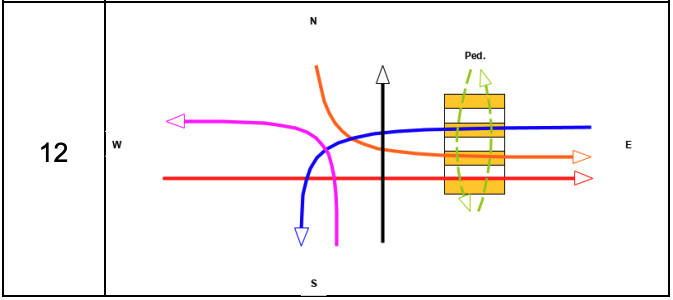
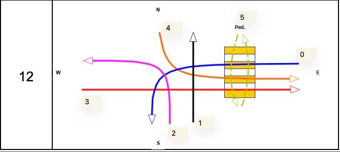

# FM Project

### Andrey Volkov - Configuration 12

Successful completion of the homework assignment involves:
1. Constructing a corresponding Promela model;
2. Verifying the model in Spin with respect to safety, liveness and fairness
properties (the scheme described in Section 4, in your case the corresponding
properties can be specified differently).

### Configuration 12



### Configuration 12 (numbered lanes)



### Intersection matrix

- 1 - represents the intersection
- 0 - represents the absence of intersection


| *   | 0   | 1   | 2   | 3   | 4   | 5   |
|-----|-----|-----|-----|-----|-----|-----|
| 0   | 0   | 1   | 1   | 1   | 1   | 1   |
| 1   | 1   | 0   | 0   | 1   | 1   | 0   |							
| 2   | 1   | 0   | 0   | 1   | 0   | 0   |							
| 3   | 1   | 1   | 1   | 0   | 0   | 1   |							 
| 4   | 1   | 1   | 0   | 0   | 0   | 1   |
| 5   | 1   | 0   | 0   | 1   | 1   | 0   |

Eventually, it can be represented as an array of `rules`:

```bash
int rules[LANES_NUM] =
{
    31, // 0: 011111
    38, // 1: 100110						
    36, // 2: 100100
    57, // 3: 111001
    49, // 4: 110001
    38  // 5: 100110 (crosswalk)
}
```

The intersection state is stored in the integer variable, (1 - green, 0 - red).
Using this approach we can check the condition using one bitwise operation.


## Promela model

The synchronization of traffic lights is implemented using semaphores (the lights are controlled by a common process). 
Only one traffic light can change the intersection state at any point in time.

The process types are the following.

### car_spawner & pedestrian_spawner

They are generating the cars on the lanes and the pedestrians on the lanes.

```bash
proctype car_spawner (int lane) {
    do
    :: lanes[lane]!CAR;
    od;
}

proctype pedestrian_spawner (int lane) {
    do
    :: lanes[lane]!PEDESTRIAN;
    od;
}
```

### intersection_controller

It sends tokens to control synchronization channels to control the intersection

This controller allows instances of traffic_light proctype  to check the state of the intersection and change it if possible

It goes through all traffic_light processes granting them control, to one process at a time:

```bash
proctype intersection_controller () {
    int next_lane_idx = 0;
    int next_lane = 0;
    int control_token = 0;

    do
    ::  next_lane = lanes_nums[next_lane_idx];
        control_send[next_lane]!next_lane;
        control_return[next_lane]?control_token;
        assert(control_token == next_lane)
        next_lane_idx = (next_lane_idx + 1) % LANES_NUM;
    od;
}
```

### traffic_light

It is a model of a single traffic light that works by the following logic:

- wait for the cars
- wait for the control token
- check intersection state (if possible, the traffic light turns green)
- return control token (if traffic light is not green, return to step (2))
- allow the cars to pass
- wait for control token
- turn RED
- return control token
- repeat from the begginning

## Verification of the model

### Safety

```bash
spin -search -m100000 -ltl safety traffic.pml
```

```
ltl safety: [] (! (((((((lights_color[1]==1)) && (((lights_color[4]==1)) || ((lights_color[3]==1)))) || (((lights_color[5]==1)) && (((lights_color[4]==1)) || ((lights_color[3]==1))))) || (((lights_color[5]==1)) && ((lights_color[0]==1)))) || (((lights_color[0]==1)) && ((((((lights_color[1]==1)) || ((lights_color[2]==1))) || ((lights_color[3]==1))) || ((lights_color[4]==1))) || ((lights_color[5]==1))))) || (((((lights_color[0]==1)) || ((lights_color[4]==1))) || ((lights_color[3]==1))) && (((lights_color[1]==1)) || ((lights_color[5]==1))))))
ltl fairness: ((((([] (<> (! ((lanes[0]?[dummy_actor]) && ((lights_color[0]==1)))))) && ([] (<> (! ((lanes[1]?[dummy_actor]) && ((lights_color[1]==1))))))) && ([] (<> (! ((lanes[2]?[dummy_actor]) && ((lights_color[2]==1))))))) && ([] (<> (! ((lanes[3]?[dummy_actor]) && ((lights_color[3]==1))))))) && ([] (<> (! ((lanes[4]?[dummy_actor]) && ((lights_color[4]==1))))))) && ([] (<> (! ((lanes[5]?[dummy_actor]) && ((lights_color[5]==1))))))
ltl liveness: ((((([] ((! ((lanes[0]?[dummy_actor]) && (! ((lights_color[0]==1))))) || (<> ((lights_color[0]==1))))) && ([] ((! ((lanes[1]?[dummy_actor]) && (! ((lights_color[1]==1))))) || (<> ((lights_color[1]==1)))))) && ([] ((! ((lanes[2]?[dummy_actor]) && (! ((lights_color[2]==1))))) || (<> ((lights_color[2]==1)))))) && ([] ((! ((lanes[3]?[dummy_actor]) && (! ((lights_color[3]==1))))) || (<> ((lights_color[3]==1)))))) && ([] ((! ((lanes[4]?[dummy_actor]) && (! ((lights_color[4]==1))))) || (<> ((lights_color[4]==1)))))) && ([] ((! ((lanes[5]?[dummy_actor]) && (! ((lights_color[5]==1))))) || (<> ((lights_color[5]==1)))))
  the model contains 3 never claims: liveness, fairness, safety
  only one claim is used in a verification run
  choose which one with ./pan -a -N name (defaults to -N safety)
  or use e.g.: spin -search -ltl safety traffic.pml
pan: ltl formula safety
pan:1: assertion violated  !( !( !(((((((lights_color[1]==1)&&((lights_color[4]==1)||(lights_color[3]==1)))||((lights_color[5]==1)&&((lights_color[4]==1)||(lights_color[3]==1))))||((lights_color[5]==1)&&(lights_color[0]==1)))||((lights_color[0]==1)&&(((((lights_color[1]==1)||(lights_color[2]==1))||(lights_color[3]==1))||(lights_color[4]==1))||(lights_color[5]==1))))||((((lights_color[0]==1)||(lights_color[4]==1))||(lights_color[3]==1))&&((lights_color[1]==1)||(lights_color[5]==1))))))) (at depth 75)
pan: wrote traffic.pml.trail

(Spin Version 6.5.2 -- 6 December 2019)
Warning: Search not completed
	+ Partial Order Reduction

Full statespace search for:
	never claim         	+ (safety)
	assertion violations	+ (if within scope of claim)
	acceptance   cycles 	+ (fairness disabled)
	invalid end states	- (disabled by never claim)

State-vector 316 byte, depth reached 75, errors: 1
       37 states, stored
        0 states, matched
       37 transitions (= stored+matched)
        0 atomic steps
hash conflicts:         0 (resolved)

Stats on memory usage (in Megabytes):
    0.012	equivalent memory usage for states (stored*(State-vector + overhead))
    0.271	actual memory usage for states
  128.000	memory used for hash table (-w24)
    5.341	memory used for DFS stack (-m100000)
  133.536	total actual memory usage


pan: elapsed time 0 seconds
```

### Fairness

```bash
spin -search -m1000000 -ltl fairness traffic.pml
```

```bash
ltl safety: [] (! (((((((lights_color[1]==1)) && (((lights_color[4]==1)) || ((lights_color[3]==1)))) || (((lights_color[5]==1)) && (((lights_color[4]==1)) || ((lights_color[3]==1))))) || (((lights_color[5]==1)) && ((lights_color[0]==1)))) || (((lights_color[0]==1)) && ((((((lights_color[1]==1)) || ((lights_color[2]==1))) || ((lights_color[3]==1))) || ((lights_color[4]==1))) || ((lights_color[5]==1))))) || (((((lights_color[0]==1)) || ((lights_color[4]==1))) || ((lights_color[3]==1))) && (((lights_color[1]==1)) || ((lights_color[5]==1))))))
ltl fairness: ((((([] (<> (! ((lanes[0]?[dummy_actor]) && ((lights_color[0]==1)))))) && ([] (<> (! ((lanes[1]?[dummy_actor]) && ((lights_color[1]==1))))))) && ([] (<> (! ((lanes[2]?[dummy_actor]) && ((lights_color[2]==1))))))) && ([] (<> (! ((lanes[3]?[dummy_actor]) && ((lights_color[3]==1))))))) && ([] (<> (! ((lanes[4]?[dummy_actor]) && ((lights_color[4]==1))))))) && ([] (<> (! ((lanes[5]?[dummy_actor]) && ((lights_color[5]==1))))))
ltl liveness: ((((([] ((! ((lanes[0]?[dummy_actor]) && (! ((lights_color[0]==1))))) || (<> ((lights_color[0]==1))))) && ([] ((! ((lanes[1]?[dummy_actor]) && (! ((lights_color[1]==1))))) || (<> ((lights_color[1]==1)))))) && ([] ((! ((lanes[2]?[dummy_actor]) && (! ((lights_color[2]==1))))) || (<> ((lights_color[2]==1)))))) && ([] ((! ((lanes[3]?[dummy_actor]) && (! ((lights_color[3]==1))))) || (<> ((lights_color[3]==1)))))) && ([] ((! ((lanes[4]?[dummy_actor]) && (! ((lights_color[4]==1))))) || (<> ((lights_color[4]==1)))))) && ([] ((! ((lanes[5]?[dummy_actor]) && (! ((lights_color[5]==1))))) || (<> ((lights_color[5]==1)))))
  the model contains 3 never claims: liveness, fairness, safety
  only one claim is used in a verification run
  choose which one with ./pan -a -N name (defaults to -N safety)
  or use e.g.: spin -search -ltl safety traffic.pml
pan: ltl formula fairness

(Spin Version 6.5.2 -- 6 December 2019)
	+ Partial Order Reduction

Full statespace search for:
	never claim         	+ (fairness)
	assertion violations	+ (if within scope of claim)
	acceptance   cycles 	+ (fairness disabled)
	invalid end states	- (disabled by never claim)

State-vector 412 byte, depth reached 68499, errors: 0
   485607 states, stored (795028 visited)
  2032184 states, matched
  2827212 transitions (= visited+matched)
        0 atomic steps
hash conflicts:     18909 (resolved)

Stats on memory usage (in Megabytes):
  203.769	equivalent memory usage for states (stored*(State-vector + overhead))
  123.356	actual memory usage for states (compression: 60.54%)
         	state-vector as stored = 238 byte + 28 byte overhead
  128.000	memory used for hash table (-w24)
   53.406	memory used for DFS stack (-m1000000)
  304.550	total actual memory usage


unreached in proctype car_spawner
	traffic.pml:34, state 5, "-end-"
	(1 of 5 states)
unreached in proctype pedestrian_spawner
	traffic.pml:40, state 5, "-end-"
	(1 of 5 states)
unreached in proctype traffic_light
	traffic.pml:82, state 30, "-end-"
	(1 of 30 states)
unreached in proctype intersection_controller
	traffic.pml:96, state 9, "-end-"
	(1 of 9 states)
unreached in init
	(0 of 19 states)
unreached in claim fairness
	_spin_nvr.tmp:44, state 48, "-end-"
	(1 of 48 states)

pan: elapsed time 1.46 seconds
pan: rate 544539.73 states/second
```

### Liveness

```bash
spin -search -m1000000 -ltl liveness traffic.pml
```

```bash
ltl safety: [] (! (((((((lights_color[1]==1)) && (((lights_color[4]==1)) || ((lights_color[3]==1)))) || (((lights_color[5]==1)) && (((lights_color[4]==1)) || ((lights_color[3]==1))))) || (((lights_color[5]==1)) && ((lights_color[0]==1)))) || (((lights_color[0]==1)) && ((((((lights_color[1]==1)) || ((lights_color[2]==1))) || ((lights_color[3]==1))) || ((lights_color[4]==1))) || ((lights_color[5]==1))))) || (((((lights_color[0]==1)) || ((lights_color[4]==1))) || ((lights_color[3]==1))) && (((lights_color[1]==1)) || ((lights_color[5]==1))))))
ltl fairness: ((((([] (<> (! ((lanes[0]?[dummy_actor]) && ((lights_color[0]==1)))))) && ([] (<> (! ((lanes[1]?[dummy_actor]) && ((lights_color[1]==1))))))) && ([] (<> (! ((lanes[2]?[dummy_actor]) && ((lights_color[2]==1))))))) && ([] (<> (! ((lanes[3]?[dummy_actor]) && ((lights_color[3]==1))))))) && ([] (<> (! ((lanes[4]?[dummy_actor]) && ((lights_color[4]==1))))))) && ([] (<> (! ((lanes[5]?[dummy_actor]) && ((lights_color[5]==1))))))
ltl liveness: ((((([] ((! ((lanes[0]?[dummy_actor]) && (! ((lights_color[0]==1))))) || (<> ((lights_color[0]==1))))) && ([] ((! ((lanes[1]?[dummy_actor]) && (! ((lights_color[1]==1))))) || (<> ((lights_color[1]==1)))))) && ([] ((! ((lanes[2]?[dummy_actor]) && (! ((lights_color[2]==1))))) || (<> ((lights_color[2]==1)))))) && ([] ((! ((lanes[3]?[dummy_actor]) && (! ((lights_color[3]==1))))) || (<> ((lights_color[3]==1)))))) && ([] ((! ((lanes[4]?[dummy_actor]) && (! ((lights_color[4]==1))))) || (<> ((lights_color[4]==1)))))) && ([] ((! ((lanes[5]?[dummy_actor]) && (! ((lights_color[5]==1))))) || (<> ((lights_color[5]==1)))))
  the model contains 3 never claims: liveness, fairness, safety
  only one claim is used in a verification run
  choose which one with ./pan -a -N name (defaults to -N safety)
  or use e.g.: spin -search -ltl safety traffic.pml
pan: ltl formula liveness
Depth=   68499 States=    1e+06 Transitions= 4.03e+06 Memory=   330.429	t=     2.08 R=   5e+05

(Spin Version 6.5.2 -- 6 December 2019)
	+ Partial Order Reduction

Full statespace search for:
	never claim         	+ (liveness)
	assertion violations	+ (if within scope of claim)
	acceptance   cycles 	+ (fairness disabled)
	invalid end states	- (disabled by never claim)

State-vector 412 byte, depth reached 68499, errors: 0
   617562 states, stored (1.05894e+06 visited)
  3206786 states, matched
  4265724 transitions (= visited+matched)
        0 atomic steps
hash conflicts:     40861 (resolved)

Stats on memory usage (in Megabytes):
  259.139	equivalent memory usage for states (stored*(State-vector + overhead))
  157.684	actual memory usage for states (compression: 60.85%)
         	state-vector as stored = 240 byte + 28 byte overhead
  128.000	memory used for hash table (-w24)
   53.406	memory used for DFS stack (-m1000000)
  338.828	total actual memory usage


unreached in proctype car_spawner
	traffic.pml:34, state 5, "-end-"
	(1 of 5 states)
unreached in proctype pedestrian_spawner
	traffic.pml:40, state 5, "-end-"
	(1 of 5 states)
unreached in proctype traffic_light
	traffic.pml:82, state 30, "-end-"
	(1 of 30 states)
unreached in proctype intersection_controller
	traffic.pml:96, state 9, "-end-"
	(1 of 9 states)
unreached in init
	(0 of 19 states)
unreached in claim liveness
	_spin_nvr.tmp:80, state 48, "-end-"
	(1 of 48 states)

pan: elapsed time 2.19 seconds
pan: rate 483533.33 states/second
```